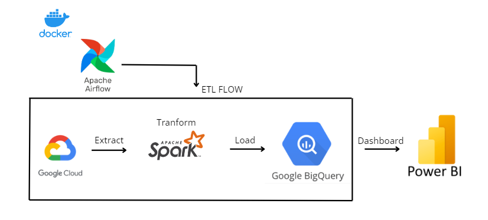
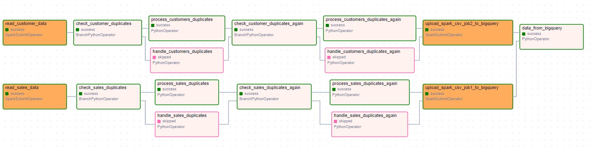
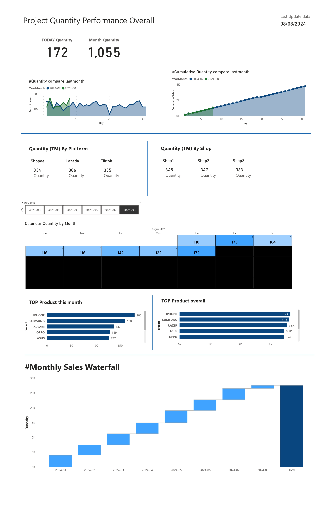

# Docker Airflow, PySpark, GCP, BigQuery

## Objective
This project demonstrates the use of Apache Airflow for orchestration, PySpark for data cleaning and validation, data extraction from Google Cloud Platform (GCP), uploading data to BigQuery, and presenting the data through Power BI. The goal is to showcase the integration of these technologies to manage and analyze data effectively.

## Features
- **PySpark 3.5.1**: Utilized for scalable data processing and transformation.
- **Airflow 2.9.3**: Employed for workflow orchestration and task management.
- **Docker Desktop v4.33.1**: Used to containerize and manage the application environment.

## Components
1. **Apache Airflow**:
   - Used to schedule and monitor workflows.
   - Configured with Docker to ensure consistency across development environments.

2. **PySpark**:
   - Handles data cleaning and validation tasks.
   - Integrated with Airflow to automate data processing pipelines.

3. **GCP (Google Cloud Platform)**:
   - Used for data storage and management.
   - Data is extracted from GCP buckets and processed with PySpark.

4. **BigQuery**:
   - Data is uploaded to BigQuery for advanced analytics and querying.

5. **Power BI**:
   - Data visualizations and dashboards are created to present insights derived from the processed data.

## Workflow
1. **Read CSV File from GCP**:
    - Use PySpark with JARs and GCP APIs to access and read the CSV file from Google Cloud Platform (GCP).
    - Transform the data using PySpark SQL .
2. **Check for Duplicates in the CSV File**:
    - Analyze the data to identify any duplicate entries.
3. **Handle Duplicates or Pass to Next Step of CSV File**:
    - If duplicates are found:
        - Pass the data to the handles_duplicated function to clear the duplicates.
    - If no duplicates are found:
        - Pass the data to the process_duplicated function to proceed to the next step.
4. **Check for Duplicates Against BigQuery**:
    - Compare the cleaned CSV data against existing records in BigQuery to identify any duplicates.
5. **Handle Duplicates or Pass to Next Step of BigQuery**:
    - If duplicates are found:
        - Pass the data to the handles_duplicated_Bigquery function to clear the duplicates.
    - If no duplicates are found:
        - Pass the data to the handles_duplicated_Bigquery function to proceed to the next step.
6. **Data upload to BigQuery**:
    - Upload the validated and deduplicated data to BigQuery.
7. **Transform Data Ready for Visualization**:
    - GRetrieve data from BigQuery for sales_data and customers_data.
    - Use PySpark SQL to perform a left join between the two datasets.

## Results project

## PowerBi Dashboard
